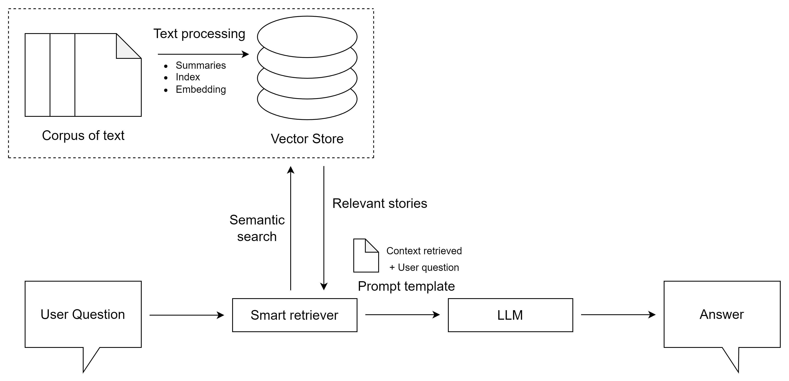

# APLN


# Resumen

Se presenta un __sistema de búsqueda de respuestas__ que combina técnicas de recuperación de información con modelos de texto generativo, aprovechando un corpus de artículos de __[CNN](https://edition.cnn.com/)__ y técnicas de web scrapping para crear un conjunto de datos propio. Este corpus, denominado NewsQASum, abarca diversos temas y se utiliza para tareas clave como Question Answering, Summarization y Text Retrieval. Se detalla el proceso de web scrapping para recolectar artículos del año 2024 del sitio web de CNN, junto con el uso de modelos de HuggingFace para generar resúmenes, preguntas y respuestas para cada artículo. La arquitectura del sistema se explora en profundidad, desde el procesamiento del corpus hasta el almacenamiento de embeddings y el flujo de la aplicación para la búsqueda y presentación de respuestas. Se evalúa la calidad de las respuestas generadas mediante métricas como BLEU, ROUGE, METEOR y DeBERTa, mostrando resultados que, aunque prometedores, no alcanzan completamente los objetivos debido a la generalidad de las noticias y preguntas en el dataset.

# Arquitectura RAG


En esta sección se examina la arquitectura empleada en la aplicación, la cual sigue el esquema típico utilizado por otros modelos RAG. Como se puede observar en la figura, se puede hacer una clara distinción en dos partes: el procesamiento previo del corpus y su almacenamiento, y el flujo normal de la aplicación. Esto da como resultado la generación de una respuesta a una pregunta formulada por el usuario, donde dicha respuesta se basa en el documento recuperado gracias a la base de datos vectorial.

# Requisitos
1. Instalar dependencias:
```
pip install -r requirements.txt
```

2. Instalar Ollama [aquí](https://ollama.com/) o instalalo directamente desde este comando el Linux.
```
curl -fsSL https://ollama.com/install.sh | sh
```

3. En el caso de disponer de GPU, se puede instalar para su uso siguiendo el tutorial de la [página oficial de PyTorch](https://pytorch.org/get-started/locally/)

# Ejecución
Una vez instaladas las dependencias necesarias, podemos ejecutar el siguiente programa.

  1. En una terminal separada, se ejecuta el siguiente comando, que inicializa el servicio Ollama.
```
ollama run llama2:7b
``` 
  2. Tras inicializar ollama, se procede a ejecutar el siguiente comando encargado levantar un servidor con FastAPI.
```
cd backend
python main.py
```

Tras ejecutar el script anterior, nos dirigimos a un navegador y buscamos [http://127.0.0.1:8000](http://127.0.0.1:8000) para poder interactuar con la aplicación.
En el caso de que el puerto 8000 este en uso, habrá que cambiarlo en el fichero de _main.py_.


# Estructura del repositorio
- `backend/` : Se encuentra todos los archivos relacionados con la ejecución de la aplicación del servidor mediante FastAPI.
  - `data/` : Carpeta donde se almacenan los ficheros de la base de datos de [Faiss](https://github.com/facebookresearch/faiss) y el dataset [glnmario/news-qa-summarization](https://huggingface.co/datasets/glnmario/news-qa-summarization) de HugginFace.
  - `demo/` : Contiene ficheros de prueba de diferentes modelos.
  - `lib/` : Contiene ficheros con las clases esenciales para cargar, leer y escribir de la base de datos vectorial y del dataset.
  - `metrics/` : Contiene un fichero para ejecutar las métricas de BLEU, ROUGE, METEOR y DeBERTa.
  - `utility/` : Contiene un wrapper del modelo para extraer un embedding del corpus. En concreto se a hecho uso de [sentence-transformers/all-mpnet-base-v2](https://huggingface.co/sentence-transformers/all-mpnet-base-v2) de HuggingFace.
- `frontend/` : Contiene el HTML y CSS empleado en la página web.
